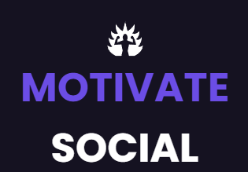

<!-- TITLE -->
<h1> MOTIVATE SOCIAL</h1> <br>
<div align="center">
  
  
<br>

Full Stack application developed as a challenge for an job apply. This is the Frontend. Read the section About the Project for complete information. 
  

[![MIT License][license-shield]](https://github.com/MarioDoncel/frontend-social-media-idip/blob/main/LICENSE)
[![LinkedIn][linkedin-shield]](https://www.linkedin.com/in/marioadoncel/)

<br />

<!-- TABLE OF CONTENTS -->
<details>
  <summary>Table of Contents</summary>
  <ol>
    <li>
      <a href="#about-the-project">About The Project</a>
      <ul>
        <li><a href="#built-with">Built With</a></li>
        <li><a href="#objective">Objective</a></li>
        <li><a href="#status">Status</a></li>
      </ul>
    </li>
    <li>
      <a href="#getting-started">Getting Started</a>
      <ul>
        <li><a href="#prerequisites">Prerequisites</a></li>
        <li><a href="#installation">Installation</a></li>
      </ul>
    </li>
    <li><a href="#usage">Usage</a></li>
    <li><a href="#license">License</a></li>
    <li><a href="#contact">Contact</a></li>
    <li><a href="#acknowledgments">Acknowledgments</a></li>
  </ol>
</details>
</div>

<!-- ABOUT THE PROJECT -->
## **About The Project**
API developed as a test for a Full Stack job apply. 

This is the Frontend.

Link to Backend : 
[https://github.com/MarioDoncel/backend-social-media-idip](https://github.com/MarioDoncel/backend-social-media-idip)

## **Test specifications:**
<hr>

### Creating a simple social networking platform with specific points to complete. The points are:

• On the social network it must be possible to register on a sign-up page and log in to it;

• User fields when registering must be:
-  Name;
-  Surname;
- Date of birth;
-  Telephone;
- E-mail;
- Password.

• Once logged into the platform the user should see all other users as well as their posts as described later;

• Each user's post must have a maximum of 500 characters;

• After the post has been made, the described text, the user's name and surname, in addition to the publication date, must be displayed;

• In each post users must be allowed to comment the related post with a maximum of 150 characters;

• After the comment has been made, the described text, the user's name and surname, in addition to the publication date, must be displayed;

• Users can follow each other as well as unfollow them;

• A user must change their basic registration information, as well as their password, and add a profile picture;

• A user may be able to delete their account and in doing so must have all their information removed;

### Mandatory criteria
1. Use typescript as a base; ✔️
2. Front-end in React or Vue; ✔️
3. Backend in Express, Adonis, Nest or Next; ✔️
4. Database of free choice; ✔️
5. Execution and functional documentation; ✔️
6. Automated tests;
7. Execution schedule; ✔️

### Free criteria
1. Carry out the layout creation phases, with the tool you want;
2. Provide public access to the result;

<hr>

## **My Project**
<hr>
The Frontend was buil with ReacJS and Typescript. 

I created as much content as possible within the stipulated time(5 days).

**Created a SignIn and SignUp pages and forms**  
**Created the following pages e subpages with functionalities**  
- Home
  - Feed.
    - Show the last 5 posts on the website. 
    - Is possible to like or comment Posts
  - Followers. 
    - List all the followers of the logged user
    - Is possible to follow and unfollow any user by clicking on the follow/unfollow button
    - Is possible to access post's user profile by clicking at the user informations
  - Followings. 
    - List all the followings of the logged user
    - Is possible to unfollow any user by clicking on the unfollow button
    - Is possible to access user's profile by clicking at the user informations
  - Posts.
    - List all the posts of the logged user 
    - Is possible to like or comment Posts
  - Theme. 
    - Didn't have time to implement the theme control. 
  - Settings. 
    - Form to update any information of the User 
    - Buttons to change password and delete account with a modal confirmation
  - Create Post.
    - Form to create a post with or without an image/picture
  - Search Results.
    - Show all the matches by first name or last name according to the value of the search bar
    - Is possible to follow and unfollow any user by clicking on the follow/unfollow button
    - Is possible to access user's profile by clicking at the user informations

**Created the Header with this functionalities:** 
  - Clicking on logo redirects to feed
  - Search bar show search results on input
  - Clicking logout clear the authentication cookies and redirect to signin page
  - Clicking on the profile image redirect to logged user profile information

  
 **Time of development**: 5 days

  - **Monday**: Backend - API, 

  - **Tuesday and Wednesday**: Frontend

  - **Thursday**: Integration Back+Front

  - **Friday**: Documentation and Deploy

<p align="right">(<a href="#top">back to top</a>)</p>


### Built With


* [Typescript](https://www.typescriptlang.org/)
* [ReactJS](https://pt-br.reactjs.org/)
* [Styled Components](https://styled-components.com/)
* [React Router](https://v5.reactrouter.com/web/guides/quick-start)
* [React Icons](https://react-icons.github.io/react-icons/)
* [Redux-Toolkit](https://redux-toolkit.js.org/)
* [Axios](https://axios-http.com/docs/intro)
* React-Toastify


<p align="right">(<a href="#top">back to top</a>)</p>

### Objective

Project developed for a job apply.
<p align="right">(<a href="#top">back to top</a>)</p>

### Status

Finished.
<p align="right">(<a href="#top">back to top</a>)</p>

<hr>
<!-- GETTING STARTED -->
## Getting Started

### Prerequisites

* npm
  ```sh
  npm install npm@latest -g
  ```

### Installation


1. Clone the repo
   ```sh
   git clone https://github.com/MarioDoncel/frontend-social-media-idip
   ```
2. Install NPM packages
   ```sh
   npm install
   ```
3. Configure your environment variables  `.env`

   ```.env
    REACT_APP_BASE_URL=http://localhost:5000/
    ```
    
   
4. Run the application
    ```js
    npm start
    ```


<p align="right">(<a href="#top">back to top</a>)</p>


<!-- USAGE EXAMPLES -->
## Usage

### BaseURL - http://localhost:3000


<p align="right">(<a href="#top">back to top</a>)</p>


<!-- LICENSE -->
## License

Distributed under the MIT License. See `LICENSE.txt` for more information.

<p align="right">(<a href="#top">back to top</a>)</p>


<!-- CONTACT -->
## Contact

Mario Andres Doncel Neto  

Email - 88mario.doncel@gmail.com <br>
Whatsapp - +55 19 99612 9909

Project Link: [https://github.com/MarioDoncel/frontend-social-media-idip](https://github.com/MarioDoncel/frontend-social-media-idip)

<p align="right">(<a href="#top">back to top</a>)</p>


<!-- ACKNOWLEDGMENTS -->
## Acknowledgments

* IDIP Tecnologia

<p align="right">(<a href="#top">back to top</a>)</p>


<!-- MARKDOWN LINKS & IMAGES -->
<!-- https://www.markdownguide.org/basic-syntax/#reference-style-links -->
[contributors-shield]: https://img.shields.io/github/contributors/othneildrew/Best-README-Template.svg?style=for-the-badge
[contributors-url]: https://github.com/othneildrew/Best-README-Template/graphs/contributors
[forks-shield]: https://img.shields.io/github/forks/othneildrew/Best-README-Template.svg?style=for-the-badge
[forks-url]: https://github.com/othneildrew/Best-README-Template/network/members
[stars-shield]: https://img.shields.io/github/stars/othneildrew/Best-README-Template.svg?style=for-the-badge
[stars-url]: https://github.com/othneildrew/Best-README-Template/stargazers
[issues-shield]: https://img.shields.io/github/issues/othneildrew/Best-README-Template.svg?style=for-the-badge
[issues-url]: https://github.com/othneildrew/Best-README-Template/issues
[license-shield]: https://img.shields.io/github/license/othneildrew/Best-README-Template.svg?style=for-the-badge
[license-url]: https://github.com/othneildrew/Best-README-Template/blob/master/LICENSE.txt
[linkedin-shield]: https://img.shields.io/badge/-LinkedIn-black.svg?style=for-the-badge&logo=linkedin&colorB=555
[linkedin-url]: https://linkedin.com/in/othneildrew
[product-screenshot]: images/screenshot.png
